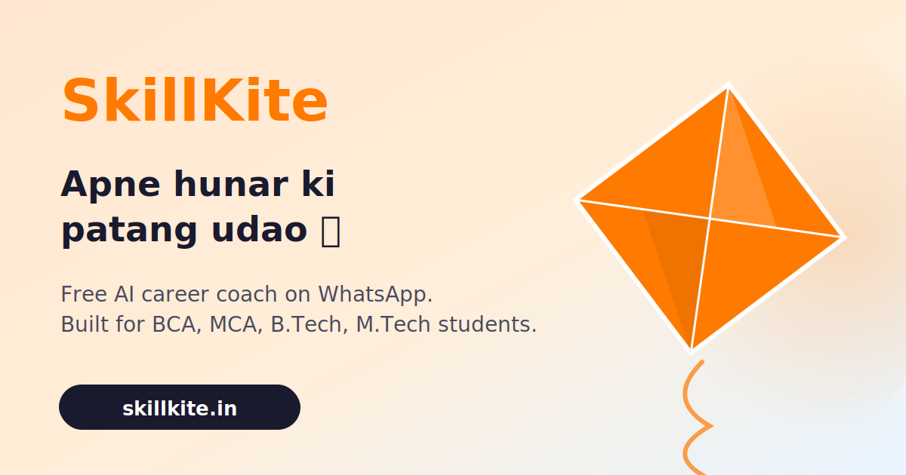

<div align="center">



# SkillKite

**Right skills. Higher reach.** 🪁
*A free AI career coach on WhatsApp for Tier 2/3 India.*

[](https://github.com/akkyyakhilesh/SkillKite/actions/workflows/ci.yml)
[](https://skillkite.pages.dev)
[](https://dotnet.microsoft.com/)
[](https://www.anthropic.com/)
[](https://www.postgresql.org/)
[](LICENSE)

</div>

---

## What it does

You message a WhatsApp number. The bot asks where you are in your journey and routes you to one of four flows:

| Flow | For | Output |
|---|---|---|
| **📚 10th ke baad** | Just finished class 10 | 3-4 page PDF covering every stream (PCM/PCB/Commerce/Arts), plus polytechnic + paramedical diploma options |
| **🎯 12th ke baad** | Just finished class 12 | Stream-specific PDF (B.Tech / MBBS / CA / BA LLB / etc.) with entrance exams + realistic salary bands |
| **💼 Career roadmap** | Degree done / final year | ~10-question assessment in Hinglish → 3 best-fit career suggestions → personalized **12–24 week roadmap PDF** with free YouTube + NPTEL resources |
| **🌱 Skill upgrade** | Already working | *(in build)* |

Everything is in Hinglish, tappable buttons over typing, and delivered as a **bilingual PDF** in the same WhatsApp chat. End-to-end in ~5 minutes.

Built for students in places like Bhagalpur, Purnea, Muzaffarpur, Darbhanga — where career counselors charge ₹5,000+ and metro mentors don't reach.

## Why it exists

90% of India's students live outside major metros. They have the same degrees as their Bangalore peers but wildly different access to career guidance, mentorship, and exposure. SkillKite is a single founder's attempt to close that gap with the one thing every student already has: a WhatsApp chat window.

Long-form thesis available on request — DM me on [LinkedIn](https://www.linkedin.com/in/akkyyakhilesh/) or [open an issue](https://github.com/akkyyakhilesh/SkillKite/issues).

## Try it

- 📱 **WhatsApp the bot:** **+91 62012 26351** — no signup, no whitelist, no early-access gate
- 🪁 **Landing page:** [skillkite.in](https://skillkite.in) → tap the green "Chat on WhatsApp" button
- 🌐 **API:** [bot.skillkite.in/api/healthz](https://bot.skillkite.in/api/healthz)

## Architecture

```
┌─────────────────┐     ┌──────────────────────┐     ┌─────────────┐
│  WhatsApp       │ →   │  .NET 8 Web API      │ →   │  Claude     │
│  Cloud API      │     │  (clean architecture) │     │  Sonnet     │
└─────────────────┘     │                       │     └─────────────┘
                        │  ┌─────────────────┐ │
┌─────────────────┐     │  │ Orchestrator   │ │     ┌─────────────┐
│  Angular PWA    │ →   │  │ Career Engine  │ │ →   │ PostgreSQL  │
│  (Phase 2)      │     │  │ PDF Generator  │ │     │ (jsonb)     │
└─────────────────┘     │  └─────────────────┘ │     └─────────────┘
                        └──────────────────────┘
```

Clean architecture, 5 projects:

| Project | Purpose |
|---|---|
| `SkillKite.Core` | Domain models, enums, DTOs, interfaces — zero infrastructure dependencies |
| `SkillKite.Data` | `AppDbContext`, EF Core migrations, career-path seed |
| `SkillKite.Infrastructure` | `ClaudeCareerEngine`, `WhatsAppService`, `RoadmapPdfGenerator`, `AssessmentOrchestrator`, `CareerPathRepository` |
| `SkillKite.API` | ASP.NET Core controllers (Webhook, Chat, Roadmap, Progress, Careers, Health) + signature-validation middleware |
| `SkillKite.Tests` | xUnit — payload parsing, HMAC verification |

The API is **frontend-agnostic**: WhatsApp today, Angular PWA tomorrow (Phase 2), Capacitor Android app (Phase 3) — same orchestrator, no rewrite.

## Tech stack

| Layer | Choice | Why |
|---|---|---|
| Web framework | **.NET 8** | Strong typing + perf, fits founder's stack experience |
| AI engine | **Claude Sonnet** (Anthropic) | Best Hinglish reasoning + JSON output reliability |
| Database | **PostgreSQL** + Npgsql | `jsonb` for flexible assessment data; cheap to host |
| Messaging | **WhatsApp Cloud API** | Zero-friction reach for Tier 2/3 users |
| PDF | **QuestPDF** + Noto Sans Devanagari | Clean bilingual rendering |
| Tunnel (dev) | **Cloudflare Tunnel** | Permanent `bot.skillkite.in` URL, no laptop port forwarding |
| Landing | Vanilla HTML/CSS/JS on **Cloudflare Pages** | Sub-500 ms load on 3G; no framework bloat |
| Analytics | **Cloudflare Web Analytics** | Privacy-first, zero JS overhead |

## Endpoints (Phase 1)

```http
GET    /api/healthz                  Liveness + DB probe
GET    /api/stats                    Aggregate counts (no PII)
GET    /api/careers                  List 27 curated career paths
GET    /api/careers/{id}             Career path detail with resources

POST   /api/chat/start               Begin an assessment session
POST   /api/chat/message             Send a message, get the reply
GET    /api/chat/session/{id}        Inspect session history

POST   /api/roadmaps/generate        Generate a roadmap for a session
GET    /api/roadmaps/{id}            Roadmap detail
GET    /api/roadmaps/{id}/pdf        Download the PDF
GET    /api/roadmaps/by-phone/{p}    All roadmaps for a student

POST   /api/progress/{roadmapId}     Log weekly progress
GET    /api/progress/{roadmapId}     Progress history

GET    /api/webhook/whatsapp         Meta verification handshake
POST   /api/webhook/whatsapp         Receive WhatsApp messages
```

## Local setup

See [`RUNNING.md`](RUNNING.md) for the full step-by-step. Short version:

```bash
# 1. secrets
cd src/SkillKite.API
dotnet user-secrets set "Claude:ApiKey" "sk-ant-..."
dotnet user-secrets set "WhatsApp:PhoneNumberId" "..."
dotnet user-secrets set "WhatsApp:AccessToken" "..."
dotnet user-secrets set "WhatsApp:AppSecret" "..."
dotnet user-secrets set "WhatsApp:VerifyToken" "your_random_string"

# 2. Postgres
docker run -d --name skillkite-pg -e POSTGRES_PASSWORD=postgres -p 5432:5432 postgres:16

# 3. Run (auto-applies migrations, seeds 27 career paths)
dotnet run --project src/SkillKite.API

# 4. Verify
curl http://localhost:5007/api/healthz
```

## Repository layout

```
SkillKite/
├── src/
│   ├── SkillKite.API/              ASP.NET Core + controllers + middleware
│   ├── SkillKite.Core/             Models, enums, interfaces, DTOs
│   ├── SkillKite.Data/             EF Core context + migrations + seed
│   └── SkillKite.Infrastructure/   Claude engine, WhatsApp service, PDF generator, orchestrator
├── tests/
│   └── SkillKite.Tests/            xUnit tests
├── site/                           Vanilla HTML landing page (Cloudflare Pages)
├── content/                        Marketing drafts (LinkedIn posts, etc.)
├── tools/                          Local-only binaries (cloudflared.exe — gitignored)
├── README.md                       This file
├── RUNNING.md                      Day-to-day dev workflow
└── SkillKite.sln
```

## Roadmap

| Phase | Status | What |
|---|---|---|
| **1. WhatsApp MVP (career roadmap)** | ✅ Shipped | Bot, Claude engine, 27 careers, bilingual PDFs |
| **1.5. 10th + 12th student flows** | ✅ Shipped | 4-way entry split, thin-discovery PDFs covering streams, polytechnic, paramedical, course selection |
| **2. Skill upgrade flow** | 🟡 Next | 4th entry option for working professionals — next ladder rung |
| **3. Angular PWA** | ⏳ Planned | Installable web app, progress dashboard, offline cache |
| **4. Android via Capacitor** | ⏳ Future | Native push notifications, Play Store listing |
| **5. Monetization** | ⏳ Future | Premium tier (mock interviews, resume builder), college B2B |
| **6. Scale** | ⏳ Future | Regional languages, mentor matching, job board |


## Contributing

This is currently a solo project being built in public. Contributions and ideas are welcome — open an issue first to discuss anything substantial. If you're a student or you know one stuck on *"what do I do next?"* — just WhatsApp **+91 62012 26351** and try the bot. No allowlist any more.

## License

MIT — see [`LICENSE`](LICENSE).

## Author

**Akhilesh Kumar** ([@akkyyakhilesh](https://github.com/akkyyakhilesh)) — building SkillKite alongside a full-time job, one weekend at a time.

If this resonates and you know a small-city student who's stuck on *"what do I do after my degree?"* — please share the link with them. That's the entire point.

🪁 *Right skills. Higher reach.*
